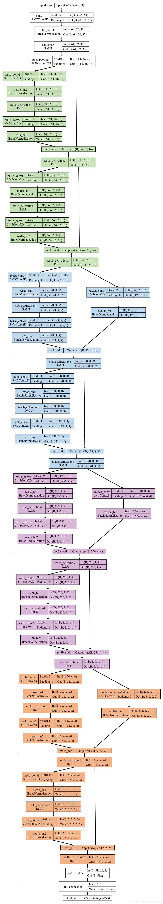
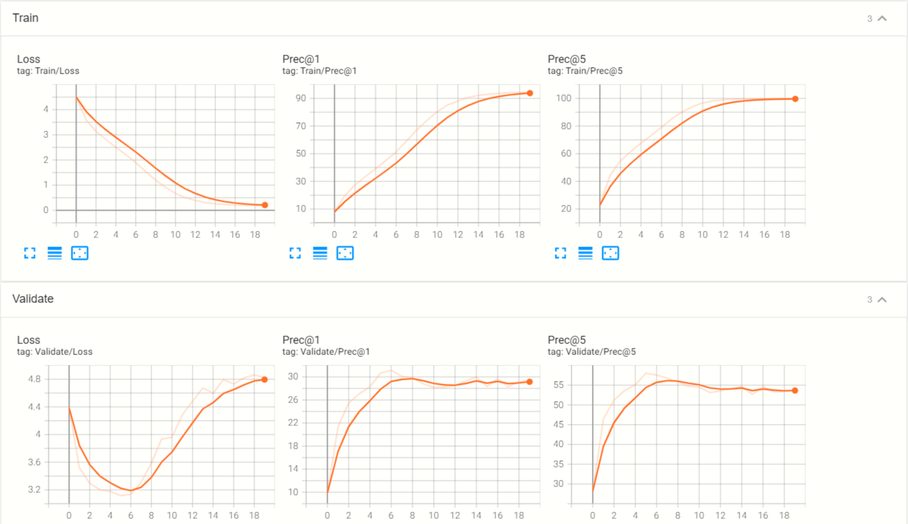

# <center> Tiny Imagenet <center>

> **1** 根据 Tiny-ImageNet 图片大小（3x64x64），计算图片经过各层处理后的中间结果的大小。

简单版：
| Layer Name      | Output Size (Input 3x64x64) | ResNet-18                   |
| --------------- | --------------------------- | --------------------------- |
| conv1           | 64x32x32                    | 7x7, 64, stride=2, pad=3    |
| max pool        | 64x16x16                    | 3x3, stride=2, pad=1        |
| layer1          | 64x16x16                    | [3x3, 64] x 2, stride = 1   |
| layer2          | 128x8x8                     | [3x3, 128] x2, stride = 2   |
| layer3          | 256x4x4                     | [3x3, 256] x2, stride = 2   |
| layer4          | 512x2x2                     | [3x3, 512] x2, stride = 2   |
| average pool    | 512x1x1                     | Adaptive Average Pooling(1) |
| Fully Connected | 200                         | 512x200                     |
| softmax         | 200                         |                             |

完整版：

这里最后的```num_class```数值为200。

> **2** 将 output 修改为 200 维。

利用原有模型创建一个新模型```resnet18_tiny```。

```{python}
resnet18_tiny = models.resnet18()
resnet18_tiny.fc = nn.Linear(512, 200)
```

> **3** 验证数据集的代码编写。 

将```tiny-imagenet-200```文件夹中的```val```文件夹重命名为```val_copy```，然后运行```validation_processing.py```，即可将验证集的数据目录结构变更为与训练集一致。该脚本首先创建一个新的文件夹```val```，在该文件夹下再创建200个文件夹，文件夹名字与```train```目录下的文件夹名字相同。接下来根据```val_copy\val_annotations.txt```的标签，将```val_copy\images\```中的图片复制到```val\```文件夹下对应的文件夹中。如```val_copy\images\val_1.JPEG```对应的文件夹为```n04067472```，就复制到```val\n04067472\```中。

> **4** 将 resnet18 在训练集上的精度（Top5）训练到 95%以上， 在 TensorBoard 中观察训练集 Loss、训练集精度、验证集 Loss、验证集精度的变化。将上述曲线进行截图，并分析曲线变化情况。



Tensorboard的结果在```runs\```文件夹中。一共训练了20个epoch，横坐标分别对应0-19。从训练曲线可以看出，在训练集上，Loss单调下降，从最初的4.502下降到最后的0.1819，这是因为梯度下降就是在训练集上完成的，同时Top1与Top5准确度都单调上升。Top1准确度从7.934%上升到94.56%，Top5准确度从22.85%上升到99.77%。
在验证集上，Loss从4.384先单调下降到3.117，在增加到4.824，原因是在训练集上的训练时间过长，导致过拟合的出现。因此，Top1准确度和Top5准确度都是先增加，到过拟合以后略微下降，最后趋于平稳。

> **5** 至少保存 2 个训练过程中模型的 checkpoint，请截图说明。使用代码中的--evaluate 选项，对比两次评估的差异，并至少找出其中 10 张评判结果不同的图片。

分别在训练了10、15、20个epoch以后保存了3个checkpoint，文件名为```checkpoint10.pth.tar``` ```checkpoint15.pth.tar``` ```checkpoint20.pth.tar```。使用```--evaluate```选项，计算出验证集的Top5的标签，分别保存为```result10.dat``` ```result15.dat``` ```result20.dat```。利用```result10.dat```和```result15.dat```进行比较，随机选择了15张评判标准不同的图片，结果保存在```compare.ipynb```中。